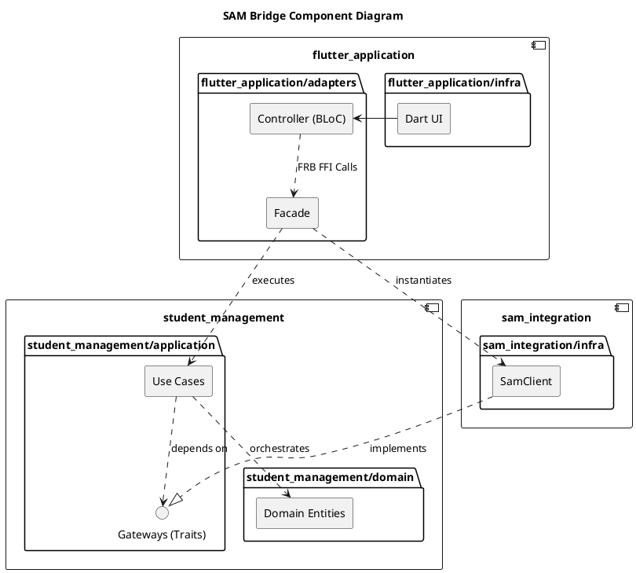

# SAM Bridge

A cross-platform mobile application built with Flutter and Rust, designed
to interface with the SAM (Sistema de Administração Musical) portal. By
leveraging the Flutter Rust Bridge (FRB), the application offloads HTML
parsing, stateful HTTP sessions, and core business logic to Rust code.

This project adheres to Clean Architecture principles and Vertical
Slices, ensuring clear separation of concerns across Bounded Contexts.

## Architecture

The codebase is structurally divided into three primary components, enforcing the
Dependency Rule where dependencies only point inward toward the core business logic:

- flutter_application (Presentation Layer): Built with Flutter and BLoC. It acts
as the UI and the Composition Root, utilizing a Rust-backed Facade to orchestrate
Dependency Injection and execute cross-boundary FFI calls.
- sam_integration (Infrastructure Layer): Handles all external I/O. It manages
stateful reqwest HTTP clients, parses complex HTML structures using scraper, maps
JSON responses to domain entities, and implements the Gateway traits defined in
the core.
- student_management (Core Layer): The heart of the application, containing pure
business logic. Organized into Vertical Slices by feature (Authentication,
Student Lessons, Student Roster), it houses the Application Use Cases and Domain
Entities with zero external dependencies.

