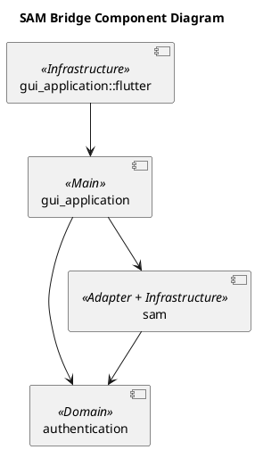

# SAM Bridge

A cross-platform application built with Flutter and Rust that bridges the SAM
(Sistema de Administração Musical) portal. Flutter Rust Bridge (FRB) offloads
stateful HTTP sessions, HTML parsing, and business orchestration to Rust,
while the Flutter side stays a thin presentation layer.

## Architecture

The project follows Clean Architecture, Vertical Slices, and Domain-Driven
Design.

Dependencies point inward: presentation → application → domain.
Infrastructure implements core-defined gateway ports; the core never knows
about HTTP or HTML.


```plantuml
@startuml
title SAM Bridge Component Diagram

component "gui_application::flutter" as ui <<Infrastructure>>
component gui_application <<Main>>
component authentication <<Domain>>
component sam <<Adapter + Infrastructure>>

ui --> gui_application
gui_application --> authentication
gui_application --> sam
sam --> authentication
@enduml
```

## Development

Common commands (from the repository root unless noted):

```sh
# Rust
cargo test --workspace
cargo clippy --workspace --all-targets
cargo llvm-cov nextest -p sam --summary-only
cargo llvm-cov nextest -p gui_application --summary-only \
  --ignore-filename-regex 'frb_generated\.rs'

# Flutter (inside gui_application/flutter)
flutter pub get
flutter analyze
flutter test
flutter run linux
flutter build linux --debug     # rm -rf build/linux if CMake cache goes stale

# Regenerate FRB bindings after changing gui_application/src/api.rs
cd gui_application/flutter && flutter_rust_bridge_codegen generate
