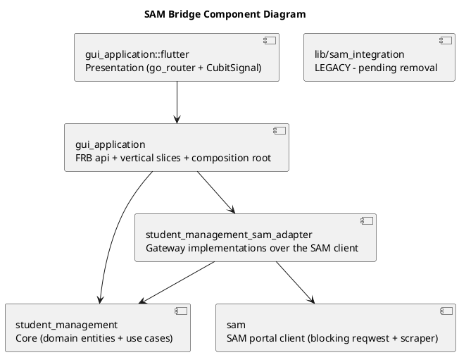

# SAM Bridge

A cross-platform application built with Flutter and Rust that bridges the SAM
(Sistema de Administração Musical) portal. Flutter Rust Bridge (FRB) offloads
stateful HTTP sessions, HTML parsing, and business orchestration to Rust,
while the Flutter side stays a thin presentation layer.

## Architecture

The project follows Clean Architecture, Vertical Slices, and Domain-Driven
Design.

Dependencies point inward: presentation → application → domain.
Infrastructure implements core-defined gateway ports; the core never knows
about HTTP or HTML.


```plantuml
@startuml
title SAM Bridge Component Diagram

component "gui_application::flutter\nPresentation (go_router + CubitSignal)" as ui
component "gui_application\nFRB api + vertical slices + composition root" as app
component "student_management\nCore (domain entities + use cases)" as core
component "student_management_sam_adapter\nGateway implementations over the SAM client" as adapter
component "sam\nSAM portal client (blocking reqwest + scraper)" as sam
component "lib/sam_integration\nLEGACY - pending removal" as legacy

ui --> app
app --> core
app --> adapter
adapter --> core
adapter --> sam
@enduml
```

### Workspace layout

```
gui_application/                 # FRB crate: api surface, slices, composition root
  src/api.rs                     #   session + FRB-exposed functions
  src/slices/{authentication,roster,lessons}/
  src/view_models.rs             #   display DTOs crossing the FFI boundary
  flutter/                       # the Flutter application (presentation only)
student_management/              # core: vertical-slice features, zero I/O deps
student_management_sam_adapter/  # core gateways implemented over `sam`
sam/                             # SAM portal client (blocking, session-aware)
lib/sam_integration/             # superseded infrastructure — to be deleted
```

## Domain contracts

- **One lessons endpoint.** Approved ("MSA") and instrument-method lessons are
  both rendered by `GET /licoes/index/{id}` as two HTML tables (`div#msa`,
  `table#datatable3`). A single fetch feeds both parsers; a missing table
  means "no lessons", not an error.
- **Tolerant parsing.** Every datum coming from SAM may be absent. Parsers and
  mappings never fail on missing cells or ids — absence flows through as
  `None`/empty all the way to the UI, which hides empty fields.
- **Blocking core, async edges.** The SAM client is blocking by design;
  adapters bridge with `smol::unblock`, and async tests use `smol`.

## Development

Prerequisites:

- Rust (channel pinned in `gui_application/rust-toolchain.toml`)
- Flutter SDK (Dart ^3.12)
- `flutter_rust_bridge_codegen` **2.13.0-beta.2** (exact version)

Common commands (from the repository root unless noted):

```sh
# Rust
cargo test --workspace
cargo clippy --workspace --all-targets
cargo llvm-cov nextest -p sam --summary-only
cargo llvm-cov nextest -p student_management_sam_adapter --summary-only
cargo llvm-cov nextest -p gui_application --summary-only \
  --ignore-filename-regex 'frb_generated\.rs'

# Flutter (inside gui_application/flutter)
flutter pub get
flutter analyze
flutter test
flutter run linux
flutter build linux --debug     # rm -rf build/linux if CMake cache goes stale

# Regenerate FRB bindings after changing gui_application/src/api.rs
cd gui_application/flutter && flutter_rust_bridge_codegen generate
```

Coverage gates are 100% regions/lines/functions for `sam`,
`student_management_sam_adapter`, and `gui_application` (generated glue
excluded). If a coverage build reports unreachable defensive arms, they are
compiled out under `cfg(coverage)` instead of being tested artificially.

## Testing conventions

- Test-driven development everywhere; tests live next to the code they cover
  (Rust `#[cfg(test)]` modules) or under `gui_application/flutter/test`.
- `cargo nextest` runs each Rust test in its own process; plain `cargo test`
  shares one, so global-state tests serialize through an in-crate mutex.
- Dart presenters are pure-Dart-testable via the `SamPortal` interface;
  widget tests use fakes — no Rust runtime required.
- Live-site capability checks live in `sam/tests/sam_http_capabilities_and_behaviour.rs`
  and run against production SAM when credentials are present.
