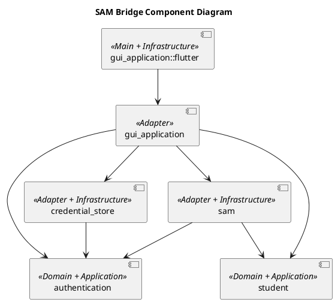

# SAM Bridge

A cross-platform application built with Flutter and Rust that bridges the SAM
(Sistema de Administração Musical) portal. Flutter Rust Bridge (FRB) offloads
stateful HTTP sessions, HTML parsing, and business orchestration to Rust,
while the Flutter side stays a thin presentation layer.

## Architecture

The project follows Test-Driven Development and applies concepts of Clean
Architecture (organized as Vertical Slices) and Domain-Driven Design.

Dependencies point inward: presentation → application → domain.
Infrastructure implements core-defined gateway ports; the core never knows
about HTTP or HTML.


```plantuml
@startuml
title SAM Bridge Component Diagram

component "gui_application::flutter" as ui <<Main + Infrastructure>>
component gui_application <<Adapter>>
component authentication <<Domain + Application>>
component student <<Domain + Application>>
component sam <<Adapter + Infrastructure>>
component credential_store <<Adapter + Infrastructure>>

ui --> gui_application

gui_application --> authentication
gui_application --> student
gui_application --> sam
gui_application --> credential_store

sam --> authentication
sam --> student

credential_store --> authentication
@enduml
```

`ui` is the true composition root (`main.dart` calls `RustLib.init()`, builds the
facade, and wires the widget tree), so it owns `<<Main>>`; `gui_application`
exposes an `ApplicationFacade` that translates use cases into FRB-friendly
DTOs, making it an `<<Adapter>>` for the delivery mechanism rather than the
outermost layer. `sam` and `credential_store` implement gateway/store ports
declared by `authentication` and `student` (dependency inversion), which is
why the arrows point from adapter to domain and never the reverse.

## Development

Common commands (from the repository root unless noted):

```sh
# Rust
cargo test --workspace
cargo clippy --workspace --all-targets
cargo llvm-cov nextest --workspace --summary-only --ignore-filename-regex 'frb_generated\.rs|/tests/support/'

# Flutter (inside gui_application/flutter)
flutter pub get
flutter analyze
flutter test
flutter run linux
flutter build linux --debug     # rm -rf build/linux if CMake cache goes stale

# Both stacks (repository root): combined line-coverage percentage
scripts/coverage.sh

# Regenerate FRB bindings after changing anything under gui_application/src/api/
cd gui_application/flutter && flutter_rust_bridge_codegen generate
