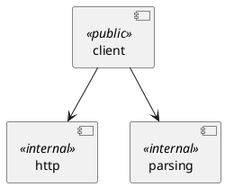

# sam

Main component responsible for interacting and abstracting the main SAM site

## Sub-components

The sam component is composed of the following sub-components:

- http
  - `SamTransport`: owns the configured HTTP client and performs raw
    communication with the website (endpoints, forms, cookies)
- parsing
  - Pure decoding of the website's raw responses into data structures
- client
  - An abstraction client that encapsulates the websites capabilities,
    orchestrating transport and parsing

